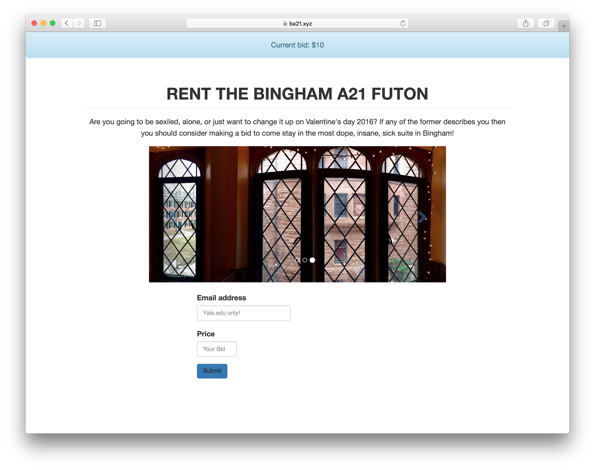

#Bingham Auction Site
##The only way to rent the best futons at Yale's Bingham hall.


###Qu'est-ce que c'est?
This is a pretty simple idea. Some friends had a futon they wanted to rent for :cupid: Valentine's day :moneybag: and I had some spare server space to put up an :moneybag: auction site :moneybag:. This is a pretty simple `Bootstrap` and `GitHub Markdown` implementation. This is clean, simple and gets to the point.

###L'utilisation de cette.
Clone this entire repo. If you open this `index.html` file without making any changes it should look like this:


Make your desired edits and then run the server setup file I've included in this repo. Once you configure the virtual hosts and point your domain at the IP of your sever everything should work.


###Permettant hôtes virtuels.
One of the main reasons that I built this was to configure virtual hosts on my Apache server. The first thing to know about this is that Apache is very tricky. For all of the domains you point at the IPv4 or your server which do not have a specified configuration file, they will be served the default configuration, or that which comes first alphabetically. Therefore, it is *extremely* advantageous to make a configuration called `000-default.com` which will always come first and therefore serve to all of your non-specified URLs.

With this out of the way you can now get to making the custom configuration for this site. Start by doing the following and replacing `ba21.xyz` with the URL you want to point to this page.  

`sudo mkdir -p /var/www/ba21.xyz/public_html`

`sudo chown -R $USER:$USER /var/www/ba21.xyz/public_html`

`sudo chmod -R 755 /var/www`

Now make your virtual host files:

`sudo mkdir /etc/httpd/sites-available`

`sudo mkdir /etc/httpd/sites-enabled`

Edit your `httpd.conf` to include the virtual hosts you just made:

`sudo nano /etc/httpd/conf/httpd.conf`

Then add this line at the very end of the file:

`IncludeOptional sites-enabled/*.conf`

Now make the virtual host file for the directory of the site you made before.

`sudo nano /etc/httpd/sites-available/ba21.xyz.conf`


Put the following in the file:
```
<VirtualHost *:80>
    ServerName www.ba21.xyz
    ServerAlias ba21.xyz
    DocumentRoot /var/www/ba21.xyz/public_html
    ErrorLog /var/www/ba21.xyz/error.log
    CustomLog /var/www/ba21.xyz/requests.log combined
</VirtualHost>
```

Make a symlink so that Apache will not it should use this file.

`sudo ln -s /etc/httpd/sites-available/ba21.xyz.conf /etc/httpd/sites-enabled/ba21.xyz.conf`

Lastly, restart Apache to see if your configuration worked and the changes took!

`sudo apachectl restart`


###Configuration de base de données du serveur.
Found in the `server` folder are the proper configuration files for your server to enable `phpMyAdmin` to work nicely with Apache. I had a lot of trouble with this so at the very least this will be a future stop for me to find these files again.

Once you have the server configured, simply make a new database and a table, change those values in the `index.php` file and then everything will work perfectly for you!
